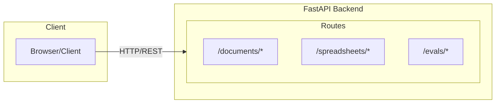

# API Reference

> Complete REST API documentation for the DiligenceVault Document Processing System

This document provides detailed information about every API endpoint, including request/response formats, status codes, and usage examples.

---

## Table of Contents

1. [Overview](#overview)
2. [Authentication](#authentication)
3. [Documents API (DOCX)](#-documents-api-docx)
4. [Spreadsheets API (Excel)](#-spreadsheets-api-excel)
5. [Evaluation API](#-evaluation-api)
6. [Error Handling](#error-handling)
7. [Rate Limiting](#rate-limiting)

---

## Overview

### Base URL

| Environment | URL |
|-------------|-----|
| Development | `http://127.0.0.1:8000` |
| Production | Configure in deployment |

### API Architecture



### Content Types

| Operation | Content-Type |
|-----------|--------------|
| File Upload | `multipart/form-data` |
| JSON Request | `application/json` |
| JSON Response | `application/json` |
| File Download | `application/vnd.openxmlformats-officedocument.*` |

### Common Response Codes

| Code | Meaning | When Used |
|------|---------|-----------|
| `200` | Success | Request completed successfully |
| `400` | Bad Request | Invalid input, validation failed |
| `404` | Not Found | Document/resource doesn't exist |
| `422` | Unprocessable Entity | Request body validation failed |
| `429` | Too Many Requests | Rate limit exceeded |
| `500` | Internal Server Error | Server-side error |

---

## Authentication

Currently, the API does not require authentication. In production, implement appropriate authentication mechanisms.

---

## 📄 Documents API (DOCX)

### Upload Document

Upload a DOCX file and parse it into editable JSON.

```http
POST /documents/
Content-Type: multipart/form-data
```

**Request Body:**
| Field | Type | Description |
|-------|------|-------------|
| `file` | File | DOCX file to upload |

**Response:** `DocumentJSON`

```json
{
  "id": "test.docx",
  "title": null,
  "blocks": [...],
  "checkboxes": [...],
  "dropdowns": [...]
}
```

**Status Codes:**
| Code | Description |
|------|-------------|
| 200 | Success |
| 400 | Invalid file type (not .docx) |

---

### Get Document

Retrieve a document by ID.

```http
GET /documents/{document_id}
```

**Path Parameters:**
| Parameter | Type | Description |
|-----------|------|-------------|
| `document_id` | string | Document identifier |

**Response:** `DocumentJSON`

**Status Codes:**
| Code | Description |
|------|-------------|
| 200 | Success |
| 404 | Document not found |

---

### Update Document

Update a document's JSON content.

```http
PUT /documents/{document_id}
Content-Type: application/json
```

**Path Parameters:**
| Parameter | Type | Description |
|-----------|------|-------------|
| `document_id` | string | Document identifier |

**Request Body:** `DocumentJSON`

**Response:** `DocumentJSON`

**Status Codes:**
| Code | Description |
|------|-------------|
| 200 | Success |
| 400 | Validation failed or ID mismatch |
| 404 | Document not found |

---

### Export Document (Metadata)

Export document to DOCX and return metadata.

```http
POST /documents/{document_id}/export
```

**Response:** `ExportResponse`

```json
{
  "id": "test.docx",
  "blocks": [...],
  "checkboxes": [...],
  "dropdowns": [...],
  "export_path": "data/exports/test.docx.v2.docx",
  "version": 2
}
```

---

### Export Document (File Download)

Export document and download the DOCX file directly.

```http
POST /documents/{document_id}/export/file
```

**Response:** Binary DOCX file

**Headers:**
```
Content-Type: application/vnd.openxmlformats-officedocument.wordprocessingml.document
Content-Disposition: attachment; filename="test.docx.v2.docx"
```

---

### AI Edit

Apply an AI-powered edit to a block or cell.

```http
POST /documents/{document_id}/ai-edit
Content-Type: application/json
```

**Request Body:**

```json
{
  "block_id": "p-0",
  "instruction": "make this more formal",
  "cell_id": null
}
```

| Field | Type | Required | Description |
|-------|------|----------|-------------|
| `block_id` | string | Yes | Target block ID |
| `instruction` | string | Yes | Edit instruction |
| `cell_id` | string | No | Target cell ID (for table cells) |

**Response:** `DocumentJSON` (with edited content)

**Status Codes:**
| Code | Description |
|------|-------------|
| 200 | Success |
| 400 | Target not found or not editable |
| 404 | Document not found |
| 500 | AI edit failed |

---

### Update Checkbox

Update a checkbox state.

```http
POST /documents/{document_id}/checkbox
Content-Type: application/json
```

**Request Body:**

```json
{
  "checkbox_id": "checkbox-12345",
  "checked": true
}
```

**Response:** `DocumentJSON`

---

### Update Dropdown

Update a dropdown selection.

```http
POST /documents/{document_id}/dropdown
Content-Type: application/json
```

**Request Body:**

```json
{
  "dropdown_id": "dropdown-12345",
  "selected": "Option 2"
}
```

**Response:** `DocumentJSON`

**Status Codes:**
| Code | Description |
|------|-------------|
| 200 | Success |
| 400 | Invalid selection (not in options) |
| 404 | Document or dropdown not found |

---

### Validate Document

Check the current document state against its original DOCX for content integrity.

```http
GET /documents/{document_id}/validate
```

**Path Parameters:**
| Parameter | Type | Description |
|-----------|------|-------------|
| `document_id` | string | Document identifier |

**Response:**

```json
{
  "document_id": "test.docx",
  "has_errors": false,
  "has_warnings": false,
  "stages": [
    {
      "stage": "raw_docx",
      "total_chars": 267387,
      "paragraph_count": 7768,
      "table_count": 124,
      "row_count": 1590,
      "cell_count": 5353,
      "run_count": 14438,
      "checkbox_count": 2973,
      "dropdown_count": 1050
    },
    {
      "stage": "parsed_json",
      "total_chars": 267387,
      "paragraph_count": 7768,
      "table_count": 124,
      "row_count": 1590,
      "cell_count": 5353,
      "run_count": 14438,
      "checkbox_count": 2973,
      "dropdown_count": 1050
    }
  ],
  "issues": []
}
```

**Status Codes:**
| Code | Description |
|------|-------------|
| 200 | Success |
| 404 | Document not found |

---

### Validate Export (Test)

Perform a test export and validate the result without saving. Useful for checking if an export will succeed before committing.

```http
POST /documents/{document_id}/validate-export
```

**Path Parameters:**
| Parameter | Type | Description |
|-----------|------|-------------|
| `document_id` | string | Document identifier |

**Response:** Same as Validate Document endpoint

**Behavior:**
1. Exports current JSON to a temporary DOCX
2. Compares exported DOCX against original
3. Reports any content loss or corruption
4. Does NOT update document version or save the export

**Status Codes:**
| Code | Description |
|------|-------------|
| 200 | Success |
| 404 | Document not found |

---

### HTML Preview

Get an HTML preview of the document.

```http
GET /documents/{document_id}/preview/html
```

**Response:** HTML content

```html
<html>
  <head>...</head>
  <body>
    <p>Paragraph content...</p>
    <table>...</table>
  </body>
</html>
```

---

## 📊 Spreadsheets API (Excel)

### Upload Spreadsheet

Upload an XLSX file and parse it into editable JSON.

```http
POST /spreadsheets/
Content-Type: multipart/form-data
```

**Request Body:**
| Field | Type | Description |
|-------|------|-------------|
| `file` | File | XLSX file to upload |

**Response:** `SpreadsheetJSON`

```json
{
  "id": "abc123_test.xlsx",
  "filename": "test.xlsx",
  "sheets": [...],
  "active_sheet_index": 0,
  "defined_names": [...],
  "metadata": {...}
}
```

**Status Codes:**
| Code | Description |
|------|-------------|
| 200 | Success |
| 400 | Invalid file type (not .xlsx) |

---

### Get Spreadsheet

Retrieve a spreadsheet by ID.

```http
GET /spreadsheets/{spreadsheet_id}
```

**Response:** `SpreadsheetJSON`

---

### Update Spreadsheet

Update a spreadsheet's JSON content.

```http
PUT /spreadsheets/{spreadsheet_id}
Content-Type: application/json
```

**Request Body:** `SpreadsheetJSON`

**Response:** `SpreadsheetJSON`

---

### Edit Single Cell

Edit a single cell value.

```http
POST /spreadsheets/{spreadsheet_id}/cell
Content-Type: application/json
```

**Request Body:**

```json
{
  "sheet": "Sheet1",
  "cell": "A1",
  "value": "New Value"
}
```

| Field | Type | Required | Description |
|-------|------|----------|-------------|
| `sheet` | string | Yes | Sheet name or index |
| `cell` | string | Yes | Cell reference (e.g., "A1") |
| `value` | string/number/bool/null | Yes | New cell value |

**Response:** `SpreadsheetJSON`

> **Formula Warning:** If the cell contains a formula, it will be cleared and replaced with the static value. The response will include a `warnings` array:
> ```json
> {
>   "id": "abc123_test.xlsx",
>   "sheets": [...],
>   "warnings": ["Cell A1 had formula '=SUM(B1:B10)' which was cleared"]
> }
> ```

---

### Edit Multiple Cells

Edit multiple cells at once.

```http
POST /spreadsheets/{spreadsheet_id}/cells
Content-Type: application/json
```

**Request Body:**

```json
{
  "edits": [
    {"sheet": "Sheet1", "cell": "A1", "value": "Value 1"},
    {"sheet": "Sheet1", "cell": "B1", "value": 42}
  ]
}
```

**Response:** `SpreadsheetJSON`

---

### Export Spreadsheet (File Download)

Export spreadsheet and download the XLSX file directly.

```http
POST /spreadsheets/{spreadsheet_id}/export/file
```

**Response:** Binary XLSX file

**Headers:**
```
Content-Type: application/vnd.openxmlformats-officedocument.spreadsheetml.sheet
Content-Disposition: attachment; filename="test_copy.xlsx"
```

---

## Evals API

### Evaluate Edit

Evaluate the quality of an edit.

```http
POST /evals/evaluate
Content-Type: application/json
```

**Request Body:**

```json
{
  "original_text": "I don't think we can do this.",
  "edited_text": "I do not think we can do this.",
  "instruction": "make formal",
  "intent": "formalize"
}
```

**Response:**

```json
{
  "preservation_score": 0.95,
  "instruction_adherence": 0.90,
  "fluency_score": 1.0,
  "overall_score": 0.94
}
```

---

### Run Test Case

Run a single test case through the AI agent.

```http
POST /evals/test
Content-Type: application/json
```

**Request Body:**

```json
{
  "original": "hello world",
  "instruction": "uppercase"
}
```

**Response:**

```json
{
  "original": "hello world",
  "instruction": "uppercase",
  "edited": "HELLO WORLD",
  "intent": "tone_adjust",
  "confidence": 0.85,
  "eval_scores": {
    "preservation_score": 1.0,
    "instruction_adherence": 1.0,
    "fluency_score": 1.0,
    "overall_score": 1.0
  },
  "timestamp": "2024-01-15T10:30:00.000Z"
}
```

---

### Run Test Suite

Run the built-in test suite.

```http
POST /evals/test-suite
```

**Response:**

```json
{
  "passed": 3,
  "total": 3,
  "pass_rate": 1.0,
  "results": [
    {
      "original": "I don't think we can't do this.",
      "instruction": "make more formal",
      "edited": "I do not think we cannot do this.",
      "passed": true
    }
  ]
}
```

---

### Get Dashboard Stats

Get aggregated evaluation statistics.

```http
GET /evals/dashboard
```

**Response:**

```json
{
  "total_evals": 50,
  "avg_overall_score": 0.87,
  "avg_preservation": 0.92,
  "avg_adherence": 0.85,
  "avg_fluency": 0.88,
  "recent_evals": [...]
}
```

---

### Clear History

Clear the evaluation history.

```http
DELETE /evals/history
```

**Response:**

```json
{
  "status": "cleared"
}
```

---

## Rate Limiting

All endpoints are rate-limited. Headers are included in responses:

```
X-RateLimit-Limit: 60
X-RateLimit-Remaining: 55
X-RateLimit-Reset: 1705312200
```

**Rate Limit Response (429):**

```json
{
  "detail": "Rate limit exceeded: 60 requests per minute",
  "retry_after": 45
}
```

| Endpoint Type | Per Minute | Per Hour |
|---------------|------------|----------|
| General | 60 | 1000 |
| AI (`/ai-edit`) | 20 | 200 |
| Burst (per second) | 15 | - |

---

## Error Responses

All errors follow this format:

```json
{
  "detail": "Error message here"
}
```

For validation errors:

```json
{
  "detail": {
    "message": "Validation failed",
    "errors": [
      {"field": "blocks.id", "message": "Duplicate block id: p-0"}
    ]
  }
}
```

---

## CORS

The API allows all origins in development mode:

```
Access-Control-Allow-Origin: *
Access-Control-Allow-Methods: *
Access-Control-Allow-Headers: *
```

**Note:** This should be restricted in production.
