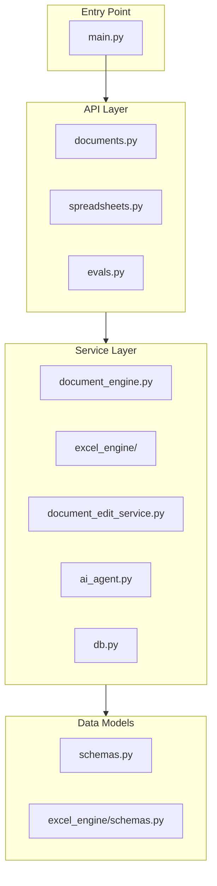

# Code Reference Documentation

> Complete module and function reference for the DiligenceVault Document Processing System

This document provides detailed documentation for every module, class, and function in the codebase. Use this as a reference when developing or debugging.

---

## Table of Contents

1. [Code Organization](#code-organization)
2. [Backend Entry Point](#backend-entry-point)
3. [API Routes](#api-routes)
4. [Services](#services)
5. [Models](#models)
6. [Middleware](#middleware)
7. [Frontend](#frontend)
8. [Tests](#tests)
9. [Debug Utilities](#debug-utilities)

---

## Code Organization



### Directory Structure

| Directory | Purpose | Key Files |
|-----------|---------|-----------|
| `api/routes/` | HTTP endpoint handlers | `documents.py`, `spreadsheets.py`, `evals.py` |
| `services/` | Business logic | `document_engine.py`, `ai_agent.py`, `db.py` |
| `services/excel_engine/` | Excel processing | `parser.py`, `writer.py`, `schemas.py` |
| `models/` | Pydantic data models | `schemas.py` |
| `middleware/` | Request middleware | `rate_limit.py` |
| `web/src/` | Frontend application | `app/page.tsx` |
| `tests/` | Test suites | `docx/`, `excel/` |
| `debug/` | Debug utilities | `docx/`, `excel/` |

---

## Backend Entry Point

### `main.py`

Application entry point that configures FastAPI.

```python
# Key components
app = FastAPI(title="Document Digital Copy POC")

# Middleware
- RateLimitMiddleware: IP-based rate limiting
- CORSMiddleware: Cross-origin requests

# Routers
- documents_router: /documents/* endpoints
- evals_router: /evals/* endpoints

# Initialization
init_db()  # Creates SQLite tables
```

**Environment Variables:**
| Variable | Purpose | Default |
|----------|---------|---------|
| `DISABLE_RATE_LIMIT` | Skip rate limiting | Not set |

---

## API Routes

### `api/routes/documents.py`

DOCX document management endpoints.

#### Functions

| Function | Endpoint | Description |
|----------|----------|-------------|
| `upload_document` | `POST /documents/` | Upload and parse DOCX |
| `get_document` | `GET /documents/{id}` | Retrieve document JSON |
| `update_document` | `PUT /documents/{id}` | Update document JSON |
| `export_document` | `POST /documents/{id}/export` | Export with metadata |
| `download_export_document` | `POST /documents/{id}/export/file` | Download DOCX file |
| `ai_edit_block` | `POST /documents/{id}/ai-edit` | AI-powered text edit |
| `update_checkbox` | `POST /documents/{id}/checkbox` | Toggle checkbox |
| `update_dropdown` | `POST /documents/{id}/dropdown` | Change dropdown |
| `preview_document_html` | `GET /documents/{id}/preview/html` | HTML preview |

---

### `api/routes/spreadsheets.py`

Excel spreadsheet management endpoints.

#### Functions

| Function | Endpoint | Description |
|----------|----------|-------------|
| `upload_spreadsheet` | `POST /spreadsheets/` | Upload and parse XLSX |
| `get_spreadsheet` | `GET /spreadsheets/{id}` | Retrieve spreadsheet JSON |
| `update_spreadsheet` | `PUT /spreadsheets/{id}` | Update spreadsheet JSON |
| `edit_cell` | `POST /spreadsheets/{id}/cell` | Edit single cell |
| `edit_cells` | `POST /spreadsheets/{id}/cells` | Edit multiple cells |
| `export_spreadsheet` | `POST /spreadsheets/{id}/export/file` | Download XLSX file |

#### Request Models

```python
class CellEditRequest(BaseModel):
    sheet: str              # Sheet name or index
    cell: str               # Cell reference (e.g., "A1")
    value: str | int | float | bool | None

class BatchCellEditRequest(BaseModel):
    edits: list[CellEditRequest]
```

#### Request Models

```python
class AIEditRequest(BaseModel):
    block_id: str           # Target block ID
    instruction: str        # Edit instruction
    cell_id: str | None     # Optional cell ID

class CheckboxUpdateRequest(BaseModel):
    checkbox_id: str
    checked: bool

class DropdownUpdateRequest(BaseModel):
    dropdown_id: str
    selected: str
```

#### Response Models

```python
class ExportResponse(DocumentJSON):
    export_path: str
    version: int
```

---

### `api/routes/evals.py`

AI evaluation dashboard endpoints.

#### Functions

| Function | Endpoint | Description |
|----------|----------|-------------|
| `evaluate_edit` | `POST /evals/evaluate` | Evaluate edit quality |
| `run_test_case` | `POST /evals/test` | Run single test |
| `run_test_suite` | `POST /evals/test-suite` | Run all tests |
| `get_dashboard_stats` | `GET /evals/dashboard` | Get statistics |
| `clear_history` | `DELETE /evals/history` | Clear eval history |

#### Models

```python
class EvalRequest(BaseModel):
    original_text: str
    edited_text: str
    instruction: str
    intent: str

class EvalResult(BaseModel):
    preservation_score: float   # 0-1
    instruction_adherence: float
    fluency_score: float
    overall_score: float

class DashboardStats(BaseModel):
    total_evals: int
    avg_overall_score: float
    avg_preservation: float
    avg_adherence: float
    avg_fluency: float
    recent_evals: List[dict]
```

---

## Services

### `services/document_engine.py`

Core DOCX processing engine.

---

### `services/excel_engine/`

Excel processing engine (isolated module for XLSX files).

#### Module Structure

| File | Purpose |
|------|---------|
| `__init__.py` | Public API exports |
| `schemas.py` | 20+ Pydantic models for Excel structures |
| `parser.py` | XLSX → JSON conversion (~1500 lines) |
| `writer.py` | JSON → XLSX conversion (byte-copy strategy) |

#### Key Functions

| Function | Location | Purpose |
|----------|----------|---------|
| `xlsx_to_json(path, id)` | `parser.py` | Parse XLSX to ExcelWorkbookJSON |
| `apply_json_to_xlsx(json, base, out)` | `writer.py` | Write JSON back to XLSX |
| `parse_sheet(...)` | `parser.py` | Parse single worksheet |

#### Parser Functions (XLSX → JSON)

| Function | Purpose |
|----------|---------|
| `_parse_shared_strings(zf)` | Extract shared string table |
| `_parse_styles(zf)` | Extract style definitions |
| `_parse_cells(sheet_el, ...)` | Extract cell data |
| `_parse_merged_cells(sheet_el, ...)` | Extract merged regions |
| `_parse_data_validations(sheet_el, ...)` | Extract dropdowns |
| `_parse_images(zf, sheet_path, ...)` | Extract embedded images |
| `_parse_comments(zf, sheet_path, ...)` | Extract cell comments |
| `_parse_hyperlinks(zf, sheet_el, ...)` | Extract hyperlinks |
| `_parse_conditional_formatting(...)` | Extract CF rules |
| `_parse_form_controls(zf, ...)` | Extract checkboxes from VML |
| `_parse_sheet_view(sheet_el, ...)` | Extract freeze panes, zoom |
| `_parse_tables(zf, sheet_path, ...)` | Extract structured tables |
| `_parse_sparklines(sheet_el, ...)` | Extract sparklines |
| `_parse_defined_names(wb_root)` | Extract named ranges |

#### Writer Strategy

The Excel writer uses a **byte-copy strategy** for high fidelity:
1. Copy original XLSX as base
2. Only update `xl/worksheets/sheet*.xml` for cells that are marked dirty
3. Update `xl/sharedStrings.xml` only when new string values are introduced
4. All other parts of the package (CF, images, VML, etc.) are preserved byte-for-byte

---

#### Constants

```python
NS = {
    "w": "http://schemas.openxmlformats.org/wordprocessingml/2006/main",
    "w14": "http://schemas.microsoft.com/office/word/2010/wordml",
    # ... 40+ namespace definitions
}
```

#### Parsing Functions (DOCX → JSON)

| Function | Purpose |
|----------|---------|
| `docx_to_json(docx_path, document_id)` | Main entry point |
| `_extract_checkboxes(root)` | Extract checkbox SDT elements |
| `_extract_dropdowns(root)` | Extract dropdown SDT elements |
| `_extract_drawing(drawing_el, index)` | Extract drawing info |
| `_iter_body_elements(body_el)` | Iterate paragraphs/tables |
| `_paragraph_to_block(p_el, index)` | Convert paragraph |
| `_table_to_block(tbl_el, index)` | Convert table |
| `_get_text_from_run(run_el)` | Extract run text |
| `_is_bold(run_el)` | Check bold formatting |
| `_is_italic(run_el)` | Check italic formatting |
| `_get_text_color(run_el)` | Get text color |
| `_get_cell_background(tc_el)` | Get cell background |
| `_get_cell_borders(tc_el)` | Get cell borders |
| `_get_cell_spans(tc_el)` | Get colspan/rowspan |

#### Export Functions (JSON → DOCX)

| Function | Purpose |
|----------|---------|
| `apply_json_to_docx(json_doc, base_path, out_path)` | Main entry point |
| `_find_node_by_ref(body_el, xml_ref)` | Resolve XML reference |
| `_patch_paragraph_runs(body, para_block)` | Update paragraph text |
| `_apply_checkbox_changes(root, checkboxes)` | Update checkboxes |
| `_apply_dropdown_changes(root, dropdowns)` | Update dropdowns |

#### Validation

| Function | Purpose |
|----------|---------|
| `validate_document_json(doc)` | Validate document structure |

---

### `services/document_edit_service.py`

Thin orchestration layer for AI-powered document edits.

#### Purpose

Single entry point for AI editing that:
1. Locates target block/cell and extracts text
2. Calls the AI agent (Gemini + LangGraph)
3. Runs evals automatically (baked-in, not bolt-on)
4. Applies edited text back to runs
5. Validates the document

#### Classes

| Class | Purpose |
|-------|----------|
| `EditTarget` | Represents the target of an edit operation |
| `EditResult` | Result of an AI edit with eval scores |
| `DocumentEditService` | Main orchestration class |

#### Key Methods

```python
# Locate target block or cell
service.locate_edit_target(doc, block_id, cell_id) -> EditTarget

# Apply AI edit with baked-in evals
await service.apply_ai_edit(doc, block_id, instruction, cell_id, context) -> EditResult
```

#### EditResult Fields

```python
@dataclass
class EditResult:
    success: bool
    edited_text: str
    original_text: str
    intent: str
    confidence: float
    reasoning: str
    eval_scores: dict | None  # Baked-in eval metrics
    validation_passed: bool
    validation_errors: list[str] | None
    error: str | None
```

---

### `services/ai_config.py`

Centralized AI configuration - single source of truth.

#### Purpose

Reads all AI settings from environment variables with sensible defaults.
All AI components use this instead of reading env vars directly.

#### Classes

| Class | Purpose |
|-------|----------|
| `AIProviderConfig` | Config for a specific provider |
| `AISettings` | All AI settings combined |

#### Environment Variables

| Variable | Purpose | Default |
|----------|---------|----------|
| `GOOGLE_API_KEY` | Gemini API key | - |
| `GEMINI_MODEL` | Gemini model name | `gemini-2.5-flash` |
| `OPENAI_API_KEY` | OpenAI API key (legacy) | - |
| `OPENAI_MODEL` | OpenAI model (legacy) | `gpt-4o-mini` |
| `ANTHROPIC_API_KEY` | Anthropic key (legacy) | - |
| `OLLAMA_HOST` | Ollama host (legacy) | `http://localhost:11434` |
| `DISABLE_EVALS` | Disable baked-in evals | `0` |
| `EVALS_LOG_TO_CONSOLE` | Log eval scores | `1` |

#### Usage

```python
from services.ai_config import get_ai_settings

settings = get_ai_settings()
print(settings.primary_provider)  # "gemini"
print(settings.gemini.model_name)  # "gemini-2.5-flash"
print(settings.gemini.api_key)     # API key from env
```

---

### `services/ai_agent.py`

LangGraph-based AI editing agent.

#### Configuration

```python
@dataclass
class AIConfig:
    """Now pulls defaults from centralized ai_config.py."""
    model_name: str | None = None  # Uses ai_config if None
    max_output_tokens: int | None = None
    temperature: float | None = None
    max_input_length: int | None = None
    max_output_length: int | None = None
    blocked_patterns: list = None
```

#### State Machine

```python
class EditState(TypedDict):
    original_text: str
    instruction: str
    context: str
    intent: str
    validation_passed: bool
    validation_errors: list[str]
    edited_text: str
    confidence: float
    reasoning: str
```

#### Classes

| Class | Purpose |
|-------|---------|
| `Guardrails` | Input/output validation |
| `GeminiClient` | Gemini API wrapper |
| `DocumentEditAgent` | High-level edit API |
| `EditEvaluator` | Edit quality metrics |

#### Key Methods

```python
# Guardrails
guardrails.validate_input(text, instruction) -> (bool, list[str])
guardrails.validate_output(original, edited, instruction) -> (bool, list[str])

# GeminiClient
client.analyze_intent(instruction) -> str
client.execute_edit(text, instruction, intent, context) -> (str, float, str)

# DocumentEditAgent
await agent.edit(text, instruction, context) -> dict

# EditEvaluator
EditEvaluator.evaluate_edit(original, edited, instruction, intent) -> dict
EditEvaluator.run_test_suite() -> list[dict]
```

#### Workflow Nodes

```
validate_input → analyze_intent → execute_edit → validate_output → END
```

---

### `services/db.py`

Database layer using SQLAlchemy.

#### Configuration

```python
DATA_DIR = Path("data")
DB_PATH = DATA_DIR / "app.db"
DATABASE_URL = f"sqlite:///{DB_PATH}"
```

#### Models

```python
class Document(Base):
    __tablename__ = "documents"
    
    id = Column(String, primary_key=True)
    base_docx_path = Column(String)
    json = Column(Text)
    version = Column(Integer, default=1)
    latest_export_path = Column(String, nullable=True)
    created_at = Column(DateTime)
    updated_at = Column(DateTime)
```

#### Functions

| Function | Purpose |
|----------|---------|
| `init_db()` | Create tables |
| `get_session()` | Context manager for DB session |

---

## Models

### `models/schemas.py`

Pydantic data models.

#### Enums

```python
class BlockType(str, Enum):
    PARAGRAPH = "paragraph"
    TABLE = "table"
    DRAWING = "drawing"
```

#### Block Models

| Model | Fields |
|-------|--------|
| `Run` | id, xml_ref, text, bold, italic, color |
| `ParagraphBlock` | type, id, xml_ref, style_name, runs |
| `DrawingBlock` | type, id, xml_ref, name, width_inches, height_inches, drawing_type |
| `TableCell` | id, xml_ref, row_span, col_span, background_color, borders, v_merge, blocks |
| `TableRow` | id, xml_ref, cells |
| `TableBlock` | type, id, xml_ref, rows |

#### Form Models

| Model | Fields |
|-------|--------|
| `CheckboxField` | id, xml_ref, label, checked |
| `DropdownField` | id, xml_ref, label, options, selected |

#### Document Model

```python
class DocumentJSON(BaseModel):
    id: str
    title: Optional[str]
    blocks: List[Block]
    checkboxes: List[CheckboxField]
    dropdowns: List[DropdownField]
```

#### Validation Models

```python
class ValidationErrorDetail(BaseModel):
    field: str
    message: str

class ValidationResult(BaseModel):
    is_valid: bool
    errors: List[ValidationErrorDetail]
```

---

## Middleware

### `middleware/rate_limit.py`

IP-based rate limiting.

#### Configuration

```python
@dataclass
class RateLimitConfig:
    requests_per_minute: int = 60
    requests_per_hour: int = 1000
    ai_requests_per_minute: int = 10
    ai_requests_per_hour: int = 100
    burst_limit: int = 10
```

#### Classes

| Class | Purpose |
|-------|---------|
| `ClientState` | Track per-client request counts |
| `RateLimitMiddleware` | FastAPI middleware |

#### Response Headers

```
X-RateLimit-Limit: 60
X-RateLimit-Remaining: 55
X-RateLimit-Reset: 1705312200
```

---

## Frontend

### `web/src/app/page.tsx`

Main document editor component.

#### State

```typescript
const [documentId, setDocumentId] = useState<string | null>(null);
const [doc, setDoc] = useState<DocumentJSON | null>(null);
const [selectedBlockId, setSelectedBlockId] = useState<string | null>(null);
const [selectedCellId, setSelectedCellId] = useState<string | null>(null);
const [instruction, setInstruction] = useState<string>("");
```

#### Key Functions

| Function | Purpose |
|----------|---------|
| `uploadFile(file)` | Upload DOCX to backend |
| `renderPreview()` | Render document preview |
| `handleSelectedTextChange(value)` | Update selected text |
| `handleAIEdit()` | Trigger AI edit |
| `handleExport()` | Export document |
| `handleToggleCheckbox(id, checked)` | Toggle checkbox |
| `handleDropdownChange(id, selected)` | Change dropdown |

#### Types

```typescript
type Run = { id, xml_ref, text, bold, italic, color }
type ParagraphBlock = { type, id, xml_ref, style_name, runs }
type TableCell = { id, xml_ref, row_span, col_span, background_color, borders, v_merge, blocks }
type TableRow = { id, xml_ref, cells }
type TableBlock = { type, id, xml_ref, rows }
type DrawingBlock = { type, id, xml_ref, name, width_inches, height_inches, drawing_type }
type Block = ParagraphBlock | TableBlock | DrawingBlock
type CheckboxField = { id, xml_ref, label, checked }
type DropdownField = { id, xml_ref, label, options, selected }
type DocumentJSON = { id, title, blocks, checkboxes, dropdowns }
```

---

### `web/src/app/evals/page.tsx`

AI evaluation dashboard.

#### Features

- Display aggregate scores
- Run individual test cases
- Run full test suite
- View recent evaluations

---

## Tests

### `tests/test_backend_e2e.py`

End-to-end backend tests.

#### Test Functions

| Function | Purpose |
|----------|---------|
| `test_1_upload_and_parse()` | Test DOCX parsing |
| `test_2_json_structure(doc)` | Validate JSON structure |
| `test_3_modify_json(doc)` | Test JSON modification |
| `test_4_export_docx(doc, label)` | Test DOCX export |
| `test_5_verify_docx(path)` | Verify exported DOCX |
| `test_6_reparse_and_compare(orig, export)` | Compare roundtrip |
| `test_7_compare_archives(orig, export)` | Compare ZIP contents |

#### Usage

```bash
# Default file
python -m tests.test_backend_e2e

# Custom file
python -m tests.test_backend_e2e "path/to/file.docx"
```

---

### `tests/docx/test_export_roundtrip.py`

Export fidelity tests.

#### Test Functions

| Function | Purpose |
|----------|---------|
| `test_export_roundtrip_preserves_zip_structure` | ZIP structure preserved |
| `test_parser_sees_final_funds_table` | Table parsing works |
| `test_edit_single_cell_and_export_contains_new_text` | Edits appear in export |

---

### `tests/docx/test_fidelity.py`

Document fidelity tests.

Tests for:
- Namespace preservation
- XML declaration format
- Text content preservation
- Checkbox/dropdown handling

---

### `tests/excel/test_excel_engine.py`

Basic Excel engine tests.

| Function | Purpose |
|----------|---------|
| `test_parse_basic_workbook` | Parse workbook structure |
| `test_parse_cells` | Parse cell values and formulas |
| `test_parse_merged_cells` | Parse merged ranges |
| `test_parse_data_validations` | Parse dropdowns |
| `test_roundtrip_basic` | Basic roundtrip test |

---

### `tests/excel/test_excel_fidelity.py`

Comprehensive Excel fidelity tests.

#### Test Functions

| Function | Purpose |
|----------|---------|
| `test_parse_completeness` | Verify all elements parsed |
| `test_roundtrip_no_changes` | Roundtrip without edits preserves structure for the sample workbook |
| `test_roundtrip_with_edit` | Edits preserve overall structure |
| `test_high_fidelity_elements` | CF, images, comments preserved for the sample workbook |

Values reported in this section (cell counts, merges, rules, etc.) are based on the bundled
sample workbook at the time of writing and are examples, not guaranteed properties for
arbitrary Excel files.

---

## Debug Utilities

Located in `debug/` folder. Not for production use.

| File | Purpose |
|------|---------|
| `debug_pipeline.py` | Test full pipeline |
| `debug_text_loss.py` | Find text loss issues |
| `debug_export_cell.py` | Debug cell export |
| `debug_dropdown_xml.py` | Inspect dropdown XML |
| `extract_ns.py` | Extract namespaces |
| `analyze_spans.py` | Analyze cell spans |
| `inspect_xlsx.py` | Inspect Excel file structure |
| `test_enhanced_parser.py` | Test enhanced Excel parser |
