# How It Works - Complete Technical Guide

> This document explains the **complete processing pipeline** from file upload to export. It covers every stage, the technology used, and why each design decision was made.

---

## Table of Contents

1. [Overview: The Complete Pipeline](#1-overview-the-complete-pipeline)
2. [Stage 1: File Upload](#2-stage-1-file-upload)
3. [Stage 2: Document Parsing](#3-stage-2-document-parsing)
4. [Stage 3: JSON Representation](#4-stage-3-json-representation)
5. [Stage 4: Frontend Display](#5-stage-4-frontend-display)
6. [Stage 5: Editing (Manual & AI)](#6-stage-5-editing-manual--ai)
7. [Stage 6: Document Export](#7-stage-6-document-export)
8. [DOCX Processing Deep Dive](#8-docx-processing-deep-dive)
9. [Excel Processing Deep Dive](#9-excel-processing-deep-dive)
10. [AI Agent Pipeline](#10-ai-agent-pipeline)

---

## 1. Overview: The Complete Pipeline

The system processes documents through a **6-stage pipeline**:

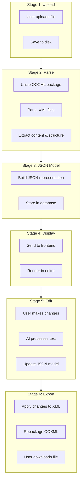

### Why This Architecture?

| Design Decision | Reason |
|-----------------|--------|
| **JSON intermediate format** | Enables frontend editing, AI processing, and database storage without touching raw XML |
| **Preserve original file** | Allows byte-copy export for unchanged parts, ensuring 100% fidelity |
| **Separate engines** | DOCX and XLSX have different structures; optimized handling for each |
| **XML reference tracking** | Enables precise mapping between JSON edits and XML locations |

---

## 2. Stage 1: File Upload

### What Happens

1. User selects a file in the browser
2. Frontend sends file via `multipart/form-data` POST request
3. Backend receives and validates the file
4. File is saved to disk with a unique ID prefix

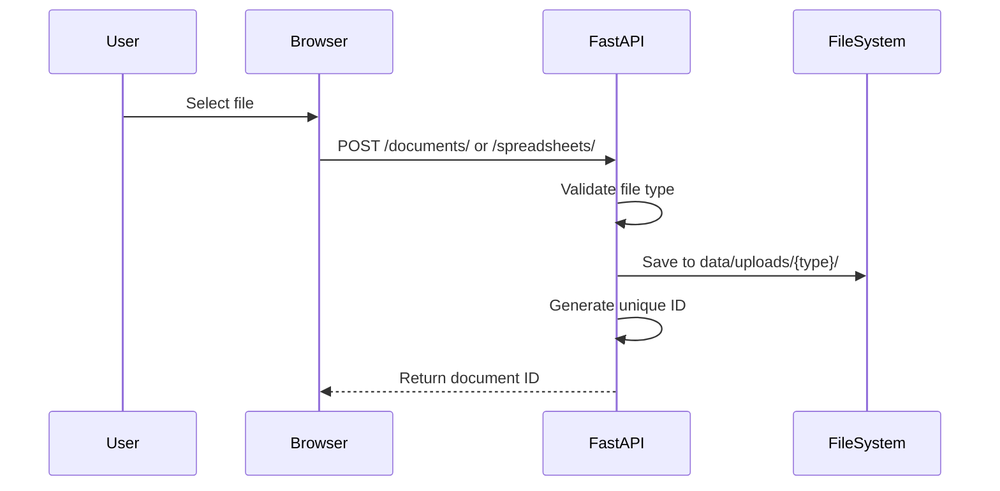

### Technology Stack

| Component | Technology | Purpose |
|-----------|------------|---------|
| Frontend upload | `<input type="file">` | File selection |
| HTTP transport | `fetch()` with FormData | Multipart upload |
| Backend handler | FastAPI `UploadFile` | Async file handling |
| File storage | Python `pathlib` | Cross-platform paths |

### Code Location

```
api/routes/documents.py    → upload_document()
api/routes/spreadsheets.py → upload_spreadsheet()
```

### File Naming Convention

```
{8-char-uuid}_{original-filename}
Example: 24adb5ab_excel_test.XLSX
```

**Why?** Prevents filename collisions while preserving the original name for user reference.

---

## 3. Stage 2: Document Parsing

### What Happens

The parser **unpacks the OOXML package** and **extracts structured content**.

#### Understanding OOXML

Both DOCX and XLSX files are **ZIP archives** containing XML files:

```
document.docx (unzipped)
├── [Content_Types].xml      # File type declarations
├── _rels/
│   └── .rels               # Package relationships
├── word/
│   ├── document.xml        # Main content ← WE PARSE THIS
│   ├── styles.xml          # Style definitions
│   └── _rels/
│       └── document.xml.rels
└── docProps/
    └── core.xml            # Metadata
```

```
spreadsheet.xlsx (unzipped)
├── [Content_Types].xml
├── xl/
│   ├── workbook.xml        # Workbook structure
│   ├── sharedStrings.xml   # Shared string table ← IMPORTANT
│   ├── styles.xml          # Cell styles
│   └── worksheets/
│       ├── sheet1.xml      # Sheet content ← WE PARSE THESE
│       └── sheet2.xml
└── _rels/
```

### DOCX Parsing Flow

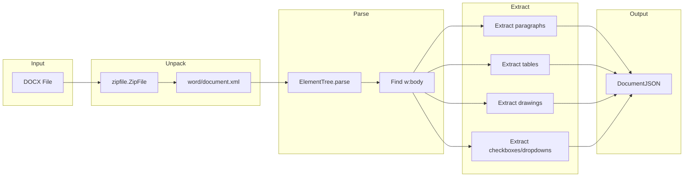

### Excel Parsing Flow

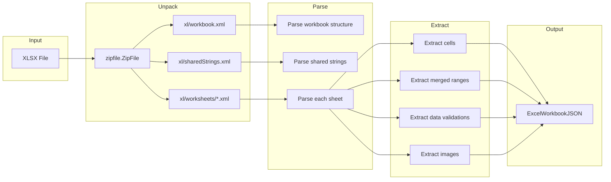

### Technology Stack

| Component | Technology | Why This Choice |
|-----------|------------|-----------------|
| ZIP handling | `zipfile` (stdlib) | No external dependencies, reliable |
| XML parsing | `xml.etree.ElementTree` (stdlib) | Fast, memory-efficient, namespace-aware |
| Data models | Pydantic v2 | Validation, serialization, type safety |

### XML Namespace Handling

OOXML uses many XML namespaces. The parser registers them for proper element lookup:

```python
NS = {
    "w": "http://schemas.openxmlformats.org/wordprocessingml/2006/main",
    "r": "http://schemas.openxmlformats.org/officeDocument/2006/relationships",
    "mc": "http://schemas.openxmlformats.org/markup-compatibility/2006",
    # ... more namespaces
}
```

**Why?** Without namespace registration, `element.find("w:p")` would fail because ElementTree doesn't know what `w:` means.

---

## 4. Stage 3: JSON Representation

### What Happens

The parsed content is converted to a **structured JSON model** that:
- Preserves document hierarchy
- Maintains formatting information
- Includes XML references for export
- Enables programmatic editing

### DOCX JSON Structure

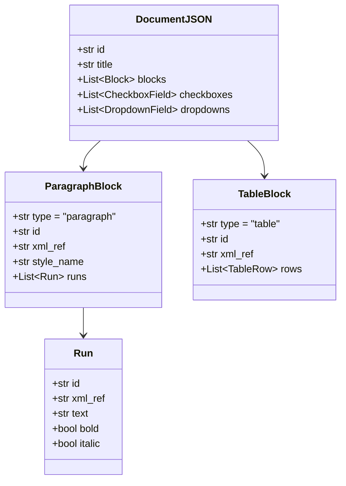

### Excel JSON Structure

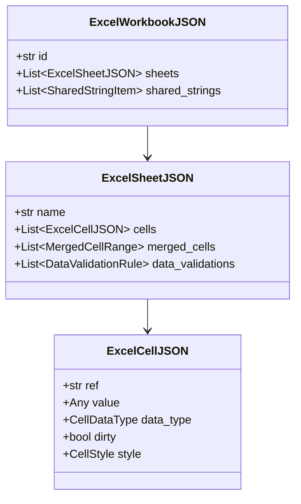

### XML Reference System

Every editable element has an `xml_ref` that maps back to its location in the XML:

| Element Type | XML Reference Format | Example |
|--------------|---------------------|---------|
| Paragraph | `p[index]` | `p[0]`, `p[5]` |
| Table | `tbl[index]` | `tbl[0]` |
| Table Cell | `tbl[t]/tr[r]/tc[c]` | `tbl[0]/tr[1]/tc[2]` |
| Run | `p[index]/r[index]` | `p[0]/r[0]` |
| Excel Cell | `{sheet}!{ref}` | `Sheet1!A1` |

**Why XML References?**
- Enable precise location of elements during export
- Allow edits to be applied to exact XML locations
- Support undo/redo by tracking change locations

---

## 5. Stage 4: Frontend Display

### What Happens

The JSON model is sent to the frontend and rendered in a **three-panel editor**:

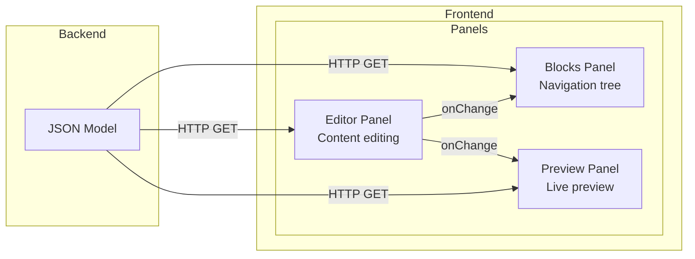

### Panel Responsibilities

| Panel | Purpose | Updates When |
|-------|---------|--------------|
| **Blocks** | Shows document structure as a tree | Document loaded, structure changes |
| **Editor** | Allows content editing | User selects a block |
| **Preview** | Shows formatted output | Any content changes |

### Technology Stack

| Component | Technology | Purpose |
|-----------|------------|---------|
| Framework | Next.js 14 | Server-side rendering, routing |
| UI Library | React 18 | Component-based UI |
| Styling | TailwindCSS | Utility-first CSS |
| State | React useState/useEffect | Local component state |
| HTTP | fetch API | Backend communication |

---

## 6. Stage 5: Editing (Manual & AI)

### Manual Editing Flow

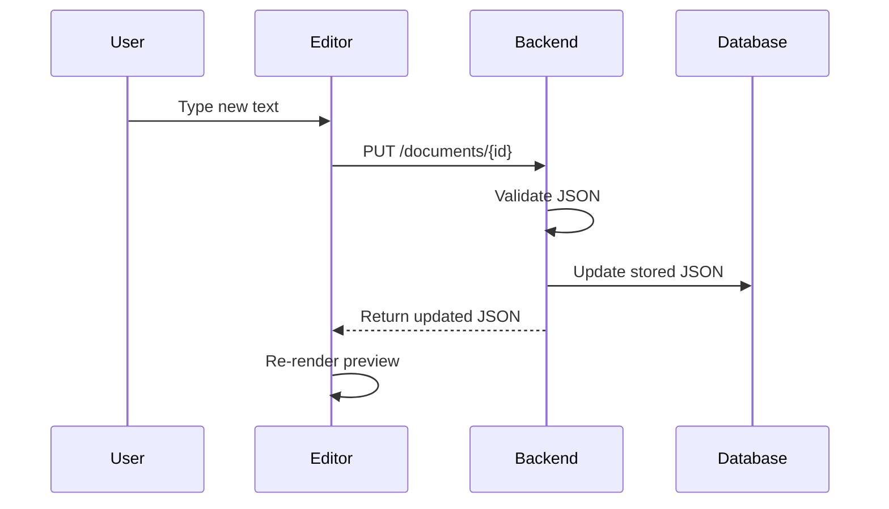

### AI Editing Flow (DOCX Only)

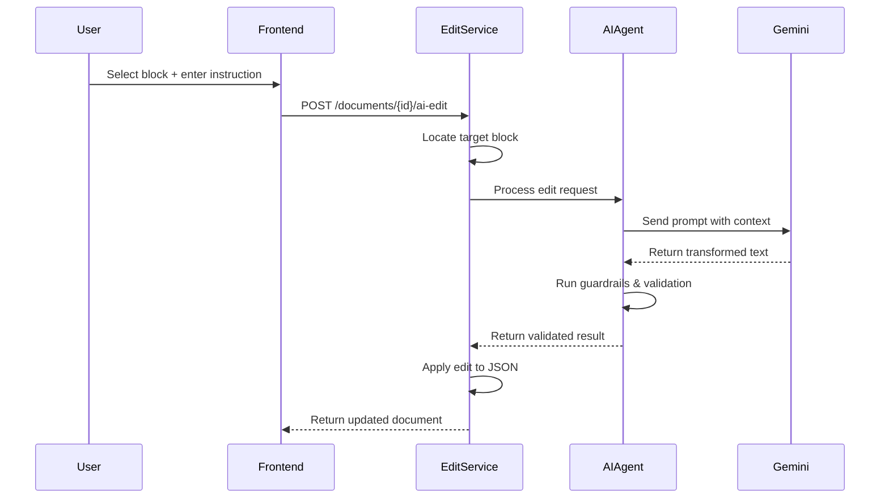

### AI Agent Architecture

The AI agent uses **LangGraph** for workflow orchestration. The diagrams in this
section show the *intended* state machine design; the current implementation in
`services/ai_agent.py` uses a simpler linear workflow:

```text
validate_input → analyze_intent → execute_edit → validate_output → END
```

There is no multi-step clarify/retry loop yet; on output validation failure the
current implementation falls back to the original text and records validation
errors.

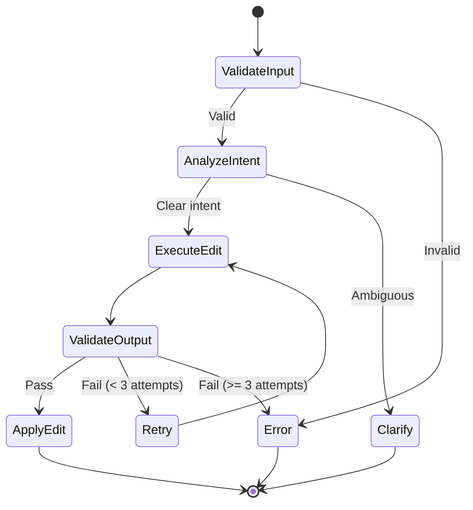

### Why LangGraph?

| Feature | Benefit |
|---------|---------|
| **State machine** | Clear workflow stages, easy debugging |
| **Conditional edges** | Handle success/failure paths |
| **Retry logic** | Automatic retry on validation failure |
| **Observability** | Built-in tracing and logging |

---

## 7. Stage 6: Document Export

### What Happens

The export process **applies JSON changes back to the original XML** and **repackages the OOXML archive**.

### Export Strategy Comparison

| Aspect | DOCX Engine | Excel Engine |
|--------|-------------|--------------|
| **Strategy** | Full XML modification | Byte-copy with selective updates |
| **Changed files** | `word/document.xml` only | Only modified sheets + sharedStrings |
| **Unchanged files** | Copied from original | Byte-for-byte copy for untouched parts |
| **Namespace handling** | Preserve all declarations | Preserve original root tags |

### DOCX Export Flow

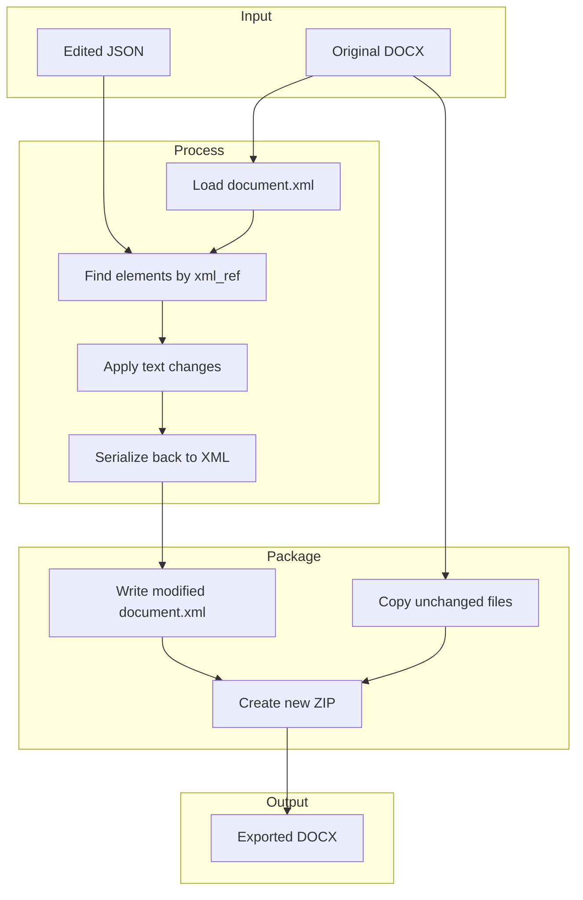

### Excel Export Flow

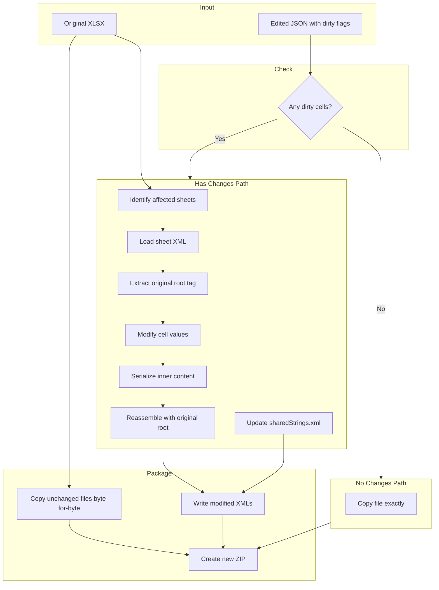

### Critical: Namespace Preservation

Excel requires **all namespace declarations** to be present, even if they appear "unused":

```xml
<!-- Original root tag - MUST be preserved exactly -->
<worksheet xmlns="http://schemas.openxmlformats.org/spreadsheetml/2006/main" 
           xmlns:r="http://schemas.openxmlformats.org/officeDocument/2006/relationships"
           xmlns:mc="http://schemas.openxmlformats.org/markup-compatibility/2006"
           mc:Ignorable="x14ac xr xr2 xr3"
           xmlns:x14ac="http://schemas.microsoft.com/office/spreadsheetml/2009/9/ac"
           xmlns:xr="http://schemas.microsoft.com/office/spreadsheetml/2014/revision"
           xmlns:xr2="http://schemas.microsoft.com/office/spreadsheetml/2015/revision2"
           xmlns:xr3="http://schemas.microsoft.com/office/spreadsheetml/2016/revision3">
```

**Why?** The `mc:Ignorable` attribute references these namespaces. If they're missing, Excel reports the file as corrupted.

**Solution in this POC:** Extract the original root tag with regex, serialize only inner
content with ElementTree, then reassemble. This strategy has been validated against the
bundled test workbooks; for arbitrary Excel files, it is a design goal rather than a
formal guarantee.

---

## 8. DOCX Processing Deep Dive

### Document Structure

A DOCX document body contains these element types:

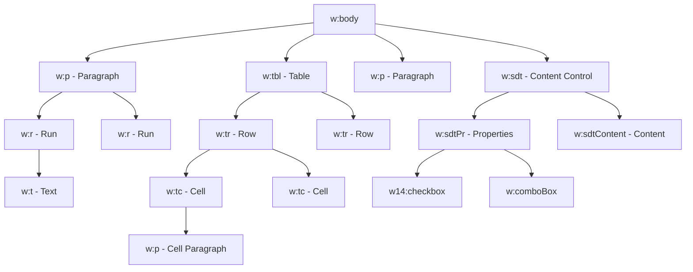

### Parsing Algorithm

```python
def parse_document(docx_path: str) -> DocumentJSON:
    # 1. Open ZIP and read document.xml
    with zipfile.ZipFile(docx_path) as zf:
        doc_xml = zf.read("word/document.xml")
    
    # 2. Parse XML
    tree = ET.parse(BytesIO(doc_xml))
    body = tree.find(".//w:body", NS)
    
    # 3. Iterate through body children
    blocks = []
    
    for i, element in enumerate(body):
        if element.tag == f"{{{NS['w']}}}p":
            # Paragraphs may contain inline SDT controls (checkboxes/dropdowns)
            blocks.append(parse_paragraph(element, i))
        elif element.tag == f"{{{NS['w']}}}tbl":
            # Tables may have SDT controls at cell or row level
            blocks.append(parse_table(element, i))
        elif element.tag == f"{{{NS['w']}}}sdt":
            # Body-level SDT - extract content
            blocks.extend(parse_body_sdt(element, i))
    
    # Legacy arrays populated from inline controls for backward compatibility
    checkboxes = doc.get_all_checkboxes()  # Extracts from inline runs
    dropdowns = doc.get_all_dropdowns()    # Extracts from inline runs
    
    return DocumentJSON(blocks=blocks, checkboxes=checkboxes, dropdowns=dropdowns)
```

### Table Cell Merging

DOCX uses `gridSpan` for horizontal merges and `vMerge` for vertical:

| Property | Meaning | JSON Field |
|----------|---------|------------|
| `w:gridSpan val="3"` | Cell spans 3 columns | `col_span: 3` |
| `w:vMerge val="restart"` | Start of vertical merge | `row_span: N` (calculated) |
| `w:vMerge` (no val) | Continuation of merge | Cell omitted |

---

## 9. Excel Processing Deep Dive

### Workbook Structure

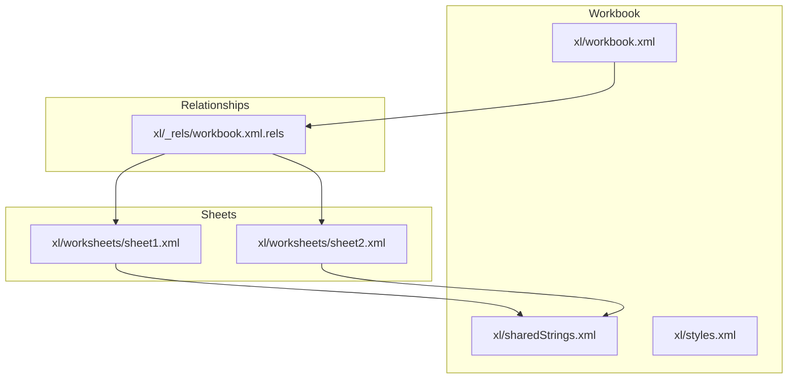

### Shared Strings Table

Excel stores unique strings in a shared table to reduce file size:

```xml
<!-- xl/sharedStrings.xml -->
<sst count="100" uniqueCount="50">
    <si><t>Hello</t></si>      <!-- index 0 -->
    <si><t>World</t></si>      <!-- index 1 -->
    <si><t>Hello</t></si>      <!-- reuses index 0 -->
</sst>
```

```xml
<!-- xl/worksheets/sheet1.xml -->
<c r="A1" t="s"><v>0</v></c>  <!-- References "Hello" -->
<c r="A2" t="s"><v>1</v></c>  <!-- References "World" -->
```

### Cell Data Types

| Type Code | Meaning | Value Storage |
|-----------|---------|---------------|
| `s` | Shared string | Index into sharedStrings.xml |
| `n` | Number | Inline numeric value |
| `b` | Boolean | 0 or 1 |
| `e` | Error | Error code (#REF!, #VALUE!, etc.) |
| `str` | Inline string | Inline text (rare) |
| (none) | Number | Inline numeric value |

### Data Validation (Dropdowns)

```xml
<dataValidations count="1">
    <dataValidation type="list" sqref="B2:B100">
        <formula1>"Yes,No,Maybe"</formula1>
    </dataValidation>
</dataValidations>
```

---

## 10. AI Agent Pipeline

### Agent State Machine

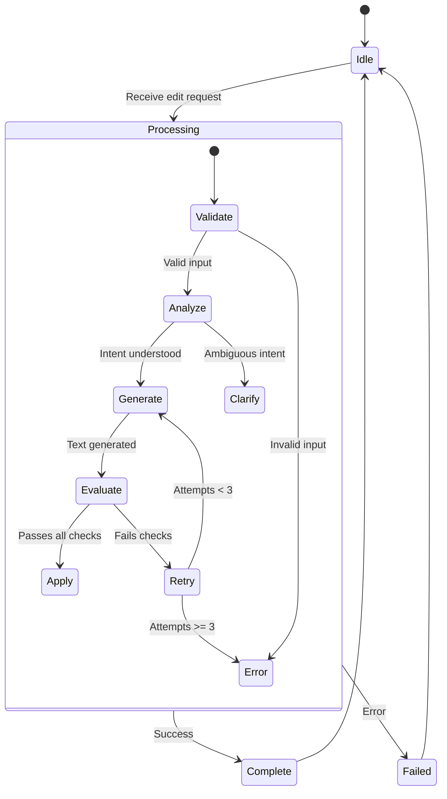

### Guardrails

| Guardrail | Purpose | Action on Failure |
|-----------|---------|-------------------|
| **Length check** | Output not too long/short | Retry with adjusted prompt |
| **Format preservation** | Maintains structure | Retry with format reminder |
| **Content safety** | No harmful content | Reject and return error |
| **Relevance check** | Output matches intent | Retry with clarification |

### Prompt Template

```python
EDIT_PROMPT = """
You are editing a document block. Apply the user's instruction to the text.

CURRENT TEXT:
{current_text}

USER INSTRUCTION:
{instruction}

RULES:
1. Only modify what the instruction asks
2. Preserve formatting markers
3. Keep the same general length unless asked to expand/shorten
4. Return ONLY the edited text, no explanations

EDITED TEXT:
"""
```

---

## Summary

The DiligenceVault Document Processing System achieves **100% document fidelity** through:

1. **Careful XML parsing** that preserves all structural information
2. **JSON intermediate format** that enables editing while maintaining references
3. **Byte-copy export** that only modifies what's necessary
4. **Namespace preservation** that satisfies strict OOXML requirements
5. **AI guardrails** that ensure edits are safe and relevant

Each stage is designed to **minimize data loss** and **maximize compatibility** with Microsoft Office applications.
