# Technical Documentation Index

> **DiligenceVault Document Processing System** - Complete Technical Reference

This documentation provides comprehensive technical details for the Document Digital Copy POC system. It explains **what** each component does, **how** it works internally, **why** design decisions were made, and the **technology stack** at each stage.

---

## What This System Does

The DiligenceVault Document Processing System is a **full-stack application** that:

1. **Parses** Microsoft Office documents (DOCX and XLSX) into structured JSON
2. **Displays** the content in an interactive web editor
3. **Enables editing** through manual input or AI-powered text transformation
4. **Exports** documents back to their original format with 100% structural fidelity

```mermaid
flowchart LR
    subgraph Input
        DOCX[📄 DOCX File]
        XLSX[📊 XLSX File]
    end
    
    subgraph Processing
        Parse[Parse Engine]
        JSON[(JSON Model)]
        Edit[Edit Layer]
    end
    
    subgraph Output
        Export[Export Engine]
        OUT_DOCX[📄 DOCX File]
        OUT_XLSX[📊 XLSX File]
    end
    
    DOCX --> Parse
    XLSX --> Parse
    Parse --> JSON
    JSON --> Edit
    Edit --> JSON
    JSON --> Export
    Export --> OUT_DOCX
    Export --> OUT_XLSX
```



---

## Documentation Map

| Document | Purpose | Read This If You Want To... |
|----------|---------|----------------------------|
| **[HOW_IT_WORKS.md](HOW_IT_WORKS.md)** | Complete processing pipeline explanation | Understand the entire system flow from upload to export |
| **[ARCHITECTURE.md](ARCHITECTURE.md)** | System design and component relationships | Understand how components connect and communicate |
| **[API.md](API.md)** | REST API reference with examples | Build integrations or understand backend endpoints |
| **[SCHEMAS.md](SCHEMAS.md)** | Data model definitions | Understand the JSON structure and data types |
| **[DEVELOPMENT.md](DEVELOPMENT.md)** | Setup, testing, and debugging | Set up the project or troubleshoot issues |
| **[CODE_REFERENCE.md](CODE_REFERENCE.md)** | Module and function reference | Find specific functions or understand code organization |

---

## Technology Stack Overview


### Stack by Layer

| Layer | Technology | Version | Purpose |
|-------|------------|---------|---------|
| **Frontend** | Next.js | 14.x | React framework with SSR |
| | React | 18.x | UI component library |
| | TypeScript | 5.x | Type-safe JavaScript |
| | TailwindCSS | 3.x | Utility-first CSS |
| **Backend** | FastAPI | 0.100+ | Async Python web framework |
| | Python | 3.10+ | Backend language |
| | Pydantic | 2.x | Data validation and serialization |
| | SQLAlchemy | 2.x | ORM for database access |
| **Processing** | xml.etree.ElementTree | stdlib | XML parsing and generation |
| | zipfile | stdlib | OOXML package handling |
| **AI** | LangGraph | 0.2+ | Agent workflow orchestration |
| | Google Gemini | 2.5-flash | LLM for text transformation |
| **Storage** | SQLite | 3.x | Document metadata and state |
| | File System | - | Document file storage |

---

## System Architecture Diagram

```mermaid
flowchart TB
    subgraph Client["Browser (Client)"]
        UI[Web Interface<br/>Next.js + React]
    end
    
    subgraph Server["Backend Server"]
        API[FastAPI Application]
        
        subgraph Routes["API Routes"]
            DocRoutes["/documents/*"]
            ExcelRoutes["/spreadsheets/*"]
            EvalRoutes["/evals/*"]
        end
        
        subgraph Services["Service Layer"]
            DocEngine[Document Engine<br/>DOCX ↔ JSON]
            ExcelEngine[Excel Engine<br/>XLSX ↔ JSON]
            EditService[Edit Service<br/>Orchestration]
            AIAgent[AI Agent<br/>LangGraph]
        end
        
        subgraph Data["Data Layer"]
            DB[(SQLite<br/>Metadata)]
            Uploads[/uploads/<br/>Original Files]
            Exports[/exports/<br/>Generated Files]
        end
    end
    
    subgraph External["External Services"]
        Gemini[Google Gemini API]
    end
    
    UI <-->|HTTP/REST| API
    API --> Routes
    Routes --> Services
    Services --> Data
    AIAgent <-->|API Call| Gemini
```

---

## Quick Start Reading Path

### For New Team Members
1. Start with **[HOW_IT_WORKS.md](HOW_IT_WORKS.md)** - understand the complete flow
2. Read **[ARCHITECTURE.md](ARCHITECTURE.md)** - understand component relationships
3. Follow **[DEVELOPMENT.md](DEVELOPMENT.md)** - set up your environment

### For Frontend Developers
1. **[API.md](API.md)** - understand available endpoints
2. **[SCHEMAS.md](SCHEMAS.md)** - understand JSON data structures
3. **[CODE_REFERENCE.md](CODE_REFERENCE.md)** §Frontend - component reference

### For Backend Developers
1. **[HOW_IT_WORKS.md](HOW_IT_WORKS.md)** - understand processing pipeline
2. **[CODE_REFERENCE.md](CODE_REFERENCE.md)** - module and function reference
3. **[SCHEMAS.md](SCHEMAS.md)** - data model definitions

### For Integration Engineers
1. **[API.md](API.md)** - complete API reference
2. **[SCHEMAS.md](SCHEMAS.md)** - request/response formats

---

## Key Concepts

### Document Fidelity
The system maintains **100% structural fidelity** - meaning documents exported after editing are identical to the original except for the specific changes made. This is achieved through:

- **Byte-copy preservation**: Non-modified parts are copied exactly
- **XML namespace preservation**: All OOXML namespaces are maintained
- **Structural integrity**: Formatting, styles, and layout are preserved

### Dual Engine Architecture
The system has two separate processing engines:

| Engine | File Type | Strategy | AI Support |
|--------|-----------|----------|------------|
| **Document Engine** | DOCX | Full XML parsing | ✅ Yes |
| **Excel Engine** | XLSX | Byte-copy with selective updates | ❌ No |

### JSON Intermediate Representation
All documents are converted to a structured JSON format that:
- Preserves document hierarchy (blocks, cells, runs)
- Maintains formatting information
- Includes XML references for precise export
- Enables programmatic editing

---

## File Structure

```
poc-2/
├── docs/                    # 📚 This documentation
│   ├── README.md           # Index (you are here)
│   ├── HOW_IT_WORKS.md     # Complete processing explanation
│   ├── ARCHITECTURE.md     # System design
│   ├── API.md              # REST API reference
│   ├── SCHEMAS.md          # Data models
│   ├── DEVELOPMENT.md      # Setup and debugging
│   └── CODE_REFERENCE.md   # Code documentation
│
├── api/routes/             # 🌐 API endpoints
├── services/               # ⚙️ Business logic
│   ├── document_engine.py  # DOCX processing
│   ├── excel_engine/       # XLSX processing
│   └── ai_agent.py         # AI editing
├── models/                 # 📋 Data schemas
├── web/                    # 🖥️ Frontend application
├── tests/                  # 🧪 Test suites
│   ├── docx/              # DOCX-specific tests
│   └── excel/             # Excel-specific tests
├── debug/                  # 🔧 Debug utilities
│   ├── docx/              # DOCX debug scripts
│   └── excel/             # Excel debug scripts
└── data/                   # 💾 Runtime data
    ├── uploads/           # Uploaded files
    │   ├── docx/         # DOCX files
    │   └── excel/        # XLSX files
    └── outputs/           # Exported files
        ├── docx/         # DOCX exports
        └── excel/        # XLSX exports
```

---

## Version History

| Version | Date | Changes |
|---------|------|---------|
| 2.1 | Dec 6, 2025 | **Inline SDT Controls**: Checkboxes and dropdowns now extracted inline within paragraph runs as `CheckboxRun`/`DropdownRun`. Legacy top-level arrays deprecated but still populated. **XLSX Formula Handling**: Cell edits now clear formulas with warning. Added `has_formula` and `formula_type` to cell data. Exposed full conditional formatting details. |
| 2.0 | Dec 3, 2025 | Added Excel engine, reorganized test/debug structure |
| 1.1 | Dec 1, 2025 | Fixed DOCX content corruption, added validation endpoints |
| 1.0 | Nov 2025 | Initial release with DOCX support |
