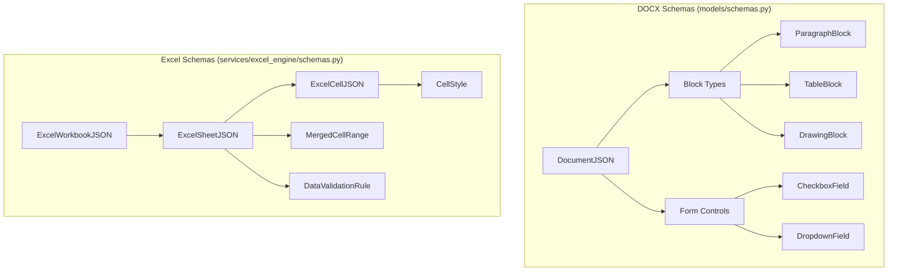

# Data Schemas Documentation

> Complete reference for all data models used in the DiligenceVault Document Processing System

This document describes every data structure, field, and relationship in the system. Understanding these schemas is essential for:
- Frontend developers consuming API responses
- Backend developers extending functionality
- Integration engineers building external tools

---

## Table of Contents

1. [Schema Overview](#schema-overview)
2. [DOCX Schemas](#docx-schemas)
3. [Excel Schemas](#excel-schemas)
4. [Database Models](#database-models)
5. [API Request/Response Models](#api-requestresponse-models)

---

## Schema Overview

The system uses **two separate schema sets** because DOCX and Excel have fundamentally different structures:



### Schema Comparison

| Aspect | DOCX Schemas | Excel Schemas |
|--------|--------------|---------------|
| **Location** | `models/schemas.py` | `services/excel_engine/schemas.py` |
| **Root Model** | `DocumentJSON` | `ExcelWorkbookJSON` |
| **Content Unit** | Block (paragraph/table/drawing) | Cell |
| **Hierarchy** | Document → Blocks → Runs | Workbook → Sheets → Cells |
| **Form Controls** | Checkboxes, Dropdowns | Data Validations |
| **Model Count** | ~15 models | ~25 models |

---

# 📄 DOCX Schemas

## Core Document Model

### DocumentJSON

The top-level representation of a DOCX document.

```python
class DocumentJSON(BaseModel):
    id: str                           # Document identifier (usually filename)
    title: Optional[str] = None       # Document title (if extracted)
    blocks: List[Block]               # Content blocks (paragraphs, tables, drawings)
    
    # DEPRECATED: Use inline CheckboxRun/DropdownRun in paragraph runs instead
    # These arrays are still populated for backward compatibility
    checkboxes: List[CheckboxField]   # OOXML checkbox controls (legacy)
    dropdowns: List[DropdownField]    # OOXML dropdown controls (legacy)
```

> **Note:** As of the latest update, checkboxes and dropdowns are now extracted **inline** within paragraph runs as `CheckboxRun` and `DropdownRun` types. The top-level `checkboxes` and `dropdowns` arrays are deprecated but still populated for backward compatibility.

**JSON Example:**

```json
{
  "id": "test.docx",
  "title": null,
  "blocks": [
    {"type": "paragraph", "id": "p-0", ...},
    {"type": "table", "id": "tbl-0", ...},
    {"type": "drawing", "id": "drawing-0", ...}
  ],
  "checkboxes": [
    {"id": "checkbox-123", "label": "Agree", "checked": false}
  ],
  "dropdowns": [
    {"id": "dropdown-456", "label": "Status", "options": ["Yes", "No"], "selected": "Yes"}
  ]
}
```

---

## Block Types

### BlockType Enum

```python
class BlockType(str, Enum):
    PARAGRAPH = "paragraph"
    TABLE = "table"
    DRAWING = "drawing"
```

### Block Union

```python
Block = Union[ParagraphBlock, TableBlock, DrawingBlock]
```

---

## Paragraph Model

### ParagraphBlock

A paragraph in the document body or inside a table cell.

```python
class ParagraphBlock(BaseModel):
    type: BlockType = BlockType.PARAGRAPH
    id: str                           # Unique identifier (e.g., "p-0")
    xml_ref: str                      # XPath-like reference (e.g., "p[0]")
    style_name: Optional[str] = None  # Word style name (e.g., "Heading1")
    runs: List[Run]                   # Text runs within the paragraph
```

### Inline Content Types

Paragraph runs can now contain three types of inline content:

```python
# Union of all inline content types
InlineContent = Union[TextRun, CheckboxRun, DropdownRun]
```

#### TextRun

Inline text run within a paragraph, bound to a specific OOXML `<w:r>` element.

```python
class TextRun(BaseModel):
    run_type: Literal["text"] = "text"  # Discriminator field
    id: str                             # Unique identifier
    xml_ref: str                        # Reference (e.g., "p[0]/r[0]")
    text: str                           # Text content
    bold: bool = False                  # Bold formatting
    italic: bool = False                # Italic formatting
    color: Optional[str] = None         # Hex color (e.g., "FF0000")
```

#### CheckboxRun

Inline checkbox content control (SDT with w14:checkbox).

```python
class CheckboxRun(BaseModel):
    run_type: Literal["checkbox"] = "checkbox"  # Discriminator field
    id: str                                      # Unique identifier
    xml_ref: str                                 # Reference to SDT element
    label: Optional[str] = None                  # Field label
    checked: bool = False                        # Checkbox state
```

#### DropdownRun

Inline dropdown/combo content control (SDT with w:dropDownList or w:comboBox).

```python
class DropdownRun(BaseModel):
    run_type: Literal["dropdown"] = "dropdown"  # Discriminator field
    id: str                                      # Unique identifier
    xml_ref: str                                 # Reference to SDT element
    label: Optional[str] = None                  # Field label
    options: List[str] = []                      # Available options
    selected: Optional[str] = None               # Currently selected value
```

> **Note:** `Run` is an alias for `TextRun` for backward compatibility.

**JSON Example:**

```json
{
  "type": "paragraph",
  "id": "p-0",
  "xml_ref": "p[0]",
  "style_name": "Normal",
  "runs": [
    {
      "id": "run-0-0",
      "xml_ref": "p[0]/r[0]",
      "text": "Hello ",
      "bold": true,
      "italic": false,
      "color": null
    },
    {
      "id": "run-0-1",
      "xml_ref": "p[0]/r[1]",
      "text": "World",
      "bold": false,
      "italic": true,
      "color": "0000FF"
    }
  ]
}
```

---

## Table Model

### TableBlock

A table in the document body.

```python
class TableBlock(BaseModel):
    type: BlockType = BlockType.TABLE
    id: str                           # Unique identifier (e.g., "tbl-0")
    xml_ref: str                      # Reference (e.g., "tbl[0]")
    rows: List[TableRow]              # Table rows
```

### TableRow

A table row consisting of one or more cells.

```python
class TableRow(BaseModel):
    id: str                           # Unique identifier
    xml_ref: str                      # Reference (e.g., "tbl[0]/tr[0]")
    cells: List[TableCell]            # Cells in this row
```

### TableCell

A logical table cell, potentially spanning multiple rows/columns.

```python
class TableCell(BaseModel):
    id: str                           # Unique identifier
    xml_ref: str                      # Reference (e.g., "tbl[0]/tr[0]/tc[0]")
    row_span: int = 1                 # Vertical span
    col_span: int = 1                 # Horizontal span
    background_color: Optional[str]   # Hex color from w:shd fill
    borders: Optional[CellBorders]    # Cell border styles
    v_merge: Optional[str] = None     # "restart" | "continue" | None
    blocks: List[ParagraphBlock] = [] # Paragraphs inside the cell
```

### CellBorders

All borders for a cell.

```python
class CellBorders(BaseModel):
    top: Optional[CellBorder] = None
    bottom: Optional[CellBorder] = None
    left: Optional[CellBorder] = None
    right: Optional[CellBorder] = None
```

### CellBorder

Border style for a cell edge.

```python
class CellBorder(BaseModel):
    style: str = "none"               # none, single, double, dashed, dotted
    width: int = 0                    # Width in eighths of a point
    color: Optional[str] = None       # Hex color
```

**JSON Example:**

```json
{
  "type": "table",
  "id": "tbl-0",
  "xml_ref": "tbl[0]",
  "rows": [
    {
      "id": "row-0-0",
      "xml_ref": "tbl[0]/tr[0]",
      "cells": [
        {
          "id": "cell-0-0-0",
          "xml_ref": "tbl[0]/tr[0]/tc[0]",
          "row_span": 1,
          "col_span": 2,
          "background_color": "FFFF00",
          "borders": {
            "top": {"style": "single", "width": 8, "color": "000000"},
            "bottom": {"style": "single", "width": 8, "color": "000000"},
            "left": {"style": "single", "width": 8, "color": "000000"},
            "right": {"style": "single", "width": 8, "color": "000000"}
          },
          "v_merge": null,
          "blocks": [
            {
              "type": "paragraph",
              "id": "p-0",
              "xml_ref": "tbl[0]/tr[0]/tc[0]/p[0]",
              "runs": [{"id": "run-0-0", "text": "Header Cell", ...}]
            }
          ]
        }
      ]
    }
  ]
}
```

---

## Drawing Model

### DrawingBlock

A drawing/image placeholder in the document.

```python
class DrawingBlock(BaseModel):
    type: BlockType = BlockType.DRAWING
    id: str                           # Unique identifier
    xml_ref: str                      # Reference (e.g., "drawing[0]")
    name: Optional[str] = None        # Drawing name from docPr
    width_inches: float = 0           # Width in inches
    height_inches: float = 0          # Height in inches
    drawing_type: str = "unknown"     # "vector_group", "image", "chart"
```

**JSON Example:**

```json
{
  "type": "drawing",
  "id": "drawing-0",
  "xml_ref": "drawing[0]",
  "name": "Company Logo",
  "width_inches": 1.5,
  "height_inches": 1.0,
  "drawing_type": "vector_group"
}
```

---

## Form Field Models

### CheckboxField

Logical view of a checkbox form field.

```python
class CheckboxField(BaseModel):
    id: str                           # Unique identifier
    xml_ref: str                      # SDT reference
    label: Optional[str] = None       # Field label
    checked: bool = False             # Checked state
```

### DropdownField

Logical view of a dropdown form field.

```python
class DropdownField(BaseModel):
    id: str                           # Unique identifier
    xml_ref: str                      # SDT reference
    label: Optional[str] = None       # Field label
    options: List[str] = []           # Available options
    selected: Optional[str] = None    # Currently selected value
```

---

## Validation Models

### ValidationResult

Result of document validation.

```python
class ValidationResult(BaseModel):
    is_valid: bool                    # Overall validity
    errors: List[ValidationErrorDetail] = []
```

### ValidationErrorDetail

Details of a validation error.

```python
class ValidationErrorDetail(BaseModel):
    field: str                        # Field path
    message: str                      # Error message
```

---

## XML Reference Format

The `xml_ref` field uses a positional path format to reference elements in the OOXML structure:

| Pattern | Description | Example |
|---------|-------------|---------|
| `p[i]` | Paragraph at index i | `p[0]` |
| `p[i]/r[j]` | Run j in paragraph i | `p[0]/r[2]` |
| `tbl[i]` | Table at index i | `tbl[0]` |
| `tbl[i]/tr[j]` | Row j in table i | `tbl[0]/tr[1]` |
| `tbl[i]/tr[j]/tc[k]` | Cell k in row j | `tbl[0]/tr[1]/tc[2]` |
| `tbl[i]/tr[j]/tc[k]/p[m]` | Paragraph m in cell | `tbl[0]/tr[1]/tc[2]/p[0]` |
| `drawing[i]` | Drawing at index i | `drawing[0]` |
| `sdt[id=X]` | SDT with ID X | `sdt[id=12345]` |

---

## DOCX End-to-End Example

This example shows a **single DOCX paragraph** from original XML → JSON → edited JSON → exported XML.

### Original DOCX XML (simplified)

```xml
<w:p>
  <w:r><w:t>Hello </w:t></w:r>
  <w:r><w:rPr><w:b/></w:rPr><w:t>World</w:t></w:r>
  <w:r><w:t>!</w:t></w:r>
</w:p>
```

### Parsed JSON (`DocumentJSON.blocks[0]`)

```json
{
  "type": "paragraph",
  "id": "p-0",
  "xml_ref": "p[0]",
  "style_name": "Normal",
  "runs": [
    { "id": "run-0-0", "xml_ref": "p[0]/r[0]", "text": "Hello ", "bold": false },
    { "id": "run-0-1", "xml_ref": "p[0]/r[1]", "text": "World", "bold": true },
    { "id": "run-0-2", "xml_ref": "p[0]/r[2]", "text": "!", "bold": false }
  ]
}
```

### Edited JSON (after user/AI changes)

Suppose the user asks AI to make the text more formal. The JSON becomes:

```json
{
  "type": "paragraph",
  "id": "p-0",
  "xml_ref": "p[0]",
  "style_name": "Normal",
  "runs": [
    { "id": "run-0-0", "xml_ref": "p[0]/r[0]", "text": "Greetings ", "bold": false },
    { "id": "run-0-1", "xml_ref": "p[0]/r[1]", "text": "World", "bold": true },
    { "id": "run-0-2", "xml_ref": "p[0]/r[2]", "text": ".", "bold": false }
  ]
}
```

### Exported DOCX XML (simplified)

```xml
<w:p>
  <w:r><w:t>Greetings </w:t></w:r>
  <w:r><w:rPr><w:b/></w:rPr><w:t>World</w:t></w:r>
  <w:r><w:t>.</w:t></w:r>
</w:p>
```

**Key points:**
- `xml_ref` ties each JSON run back to a specific `<w:r>` element.
- Styles (like `<w:b/>` for bold) are **preserved** automatically; only text is changed.
- The exporter only patches the text nodes; everything else (layout, borders, etc.) stays untouched.

---

## Database Model

### Document Table

SQLAlchemy model for document storage.

```python
class Document(Base):
    __tablename__ = "documents"

    id = Column(String, primary_key=True)    # Document ID
    base_docx_path = Column(String)          # Path to original DOCX
    json = Column(Text)                      # Serialized DocumentJSON
    version = Column(Integer, default=1)     # Version counter
    latest_export_path = Column(String)      # Path to latest export
    created_at = Column(DateTime)            # Creation timestamp
    updated_at = Column(DateTime)            # Last update timestamp
```

---

## AI Agent State

### EditState

State for the LangGraph editing workflow.

```python
class EditState(TypedDict):
    # Input
    original_text: str                # Original text to edit
    instruction: str                  # User's edit instruction
    context: str                      # Additional context
    
    # Processing
    intent: str                       # Detected intent
    validation_passed: bool           # Input validation result
    validation_errors: list[str]      # Validation error messages
    
    # Output
    edited_text: str                  # Edited text result
    confidence: float                 # Confidence score (0-1)
    reasoning: str                    # Explanation of edit
```

### Intent Categories

| Intent | Description |
|--------|-------------|
| `formalize` | Make text more formal/professional |
| `simplify` | Make text simpler/more concise |
| `correct` | Fix grammar, spelling, punctuation |
| `expand` | Add more detail or explanation |
| `summarize` | Condense the text |
| `rephrase` | Reword without changing meaning |
| `tone_adjust` | Change emotional tone |
| `other` | Any other type of edit |

## Core Workbook Model

### ExcelWorkbookJSON

Top-level editable representation of an Excel workbook.

```python
class ExcelWorkbookJSON(BaseModel):
    id: str
    filename: Optional[str] = None
    sheets: List[ExcelSheetJSON] = []
    active_sheet_index: int = 0

    # Shared data
    shared_strings: List[SharedStringItem] = []
    defined_names: List[DefinedName] = []

    # Metadata
    created: Optional[str] = None
    modified: Optional[str] = None
    creator: Optional[str] = None
    last_modified_by: Optional[str] = None
```

---

## Sheet Model

### ExcelSheetJSON

A single worksheet containing cells, structure, and rich elements.

```python
class ExcelSheetJSON(BaseModel):
    id: str
    name: str
    sheet_index: int
    is_hidden: bool = False

    # Dimension of used range (e.g. "A1:F20")
    dimension: Optional[str] = None

    # Core data
    cells: List[ExcelCellJSON] = []
    merged_cells: List[MergedCellRange] = []
    data_validations: List[DataValidationRule] = []
    columns: List[ColumnInfo] = []
    rows: List[RowInfo] = []

    # Embedded / complex content
    images: List[ExcelImage] = []
    comments: List[ExcelComment] = []
    hyperlinks: List[ExcelHyperlink] = []
    conditional_formatting: List[ConditionalFormatting] = []
    form_controls: List[FormControl] = []
    tables: List[ExcelTable] = []
    sparkline_groups: List[SparklineGroup] = []

    # View configuration
    sheet_view: Optional[SheetView] = None
```

---

## Cell Model

### ExcelCellJSON

A single cell with value, formula, style, and merge information.

```python
class ExcelCellJSON(BaseModel):
    id: str
    ref: str                   # Cell reference, e.g. "A1"
    row: int                   # 1-indexed row number
    col: int                   # 1-indexed column number
    col_letter: str            # Column letter, e.g. "A", "AA"

    # Value and type
    value: Optional[Any] = None
    raw_value: Optional[str] = None
    data_type: Optional[CellDataType] = None

    # Formula metadata
    formula: Optional[str] = None
    formula_type: Optional[str] = None
    shared_formula_ref: Optional[str] = None
    shared_formula_si: Optional[int] = None

    # Styling
    style: Optional[CellStyle] = None
    style_index: Optional[int] = None

    # Merge info
    is_merged: bool = False
    merge_range: Optional[str] = None
    is_merge_origin: bool = False

    # Edit tracking (internal)
    dirty: bool = Field(default=False, exclude=True)
    original_value: Optional[Any] = Field(default=None, exclude=True)
```

---

## Complex Elements

### ConditionalFormatting

```python
class ConditionalFormatting(BaseModel):
    id: str
    sheet_id: str
    sqref: str                                 # Affected range
    rules: List[CFRule] = []                   # Formatting rules
```

### FormControl

```python
class FormControl(BaseModel):
    id: str
    sheet_id: str
    control_type: FormControlType              # checkbox, radio, button, etc.
    anchor: Optional[str] = None               # Cell anchor
    checked: Optional[bool] = None             # For checkboxes
    linked_cell: Optional[str] = None          # Linked cell reference
```

### DefinedName

```python
class DefinedName(BaseModel):
    name: str                                  # Name (e.g., "PrintArea")
    value: str                                 # Formula/reference
    scope: Optional[int] = None                # Sheet scope (None = global)
    is_builtin: bool = False                   # Built-in name
```

### SheetView / FreezePane

```python
class FreezePane(BaseModel):
    x_split: int = 0                           # Frozen columns
    y_split: int = 0                           # Frozen rows
    top_left_cell: Optional[str] = None        # First unfrozen cell

class SheetView(BaseModel):
    sheet_id: str
    zoom_scale: int = 100                      # Zoom percentage
    show_gridlines: bool = True
    show_formulas: bool = False
    freeze_pane: Optional[FreezePane] = None
```

---

## Excel Schema Summary

| Category | Models |
|----------|--------|
| **Core** | ExcelWorkbookJSON, ExcelSheetJSON, ExcelCellJSON |
| **Styling** | CellStyle, FontStyle, FillStyle, BorderStyle |
| **Structure** | MergedCellRange, ColumnInfo, RowInfo |
| **Data** | DataValidationRule, SharedStringItem |
| **Complex** | ConditionalFormatting, CFRule, FormControl |
| **Metadata** | DefinedName, ExcelHyperlink, ExcelComment |
| **View** | SheetView, FreezePane |
| **Objects** | ExcelImage, ExcelTable, SparklineGroup |

---

## Excel End-to-End Example

This example shows a **single Excel cell** with a dropdown list from original XML → JSON → edited JSON → exported XML.

### Original XLSX XML (simplified)

`xl/sharedStrings.xml`:

```xml
<sst count="3" uniqueCount="3" xmlns="http://schemas.openxmlformats.org/spreadsheetml/2006/main">
  <si><t>Pending</t></si>   <!-- index 0 -->
  <si><t>Approved</t></si>  <!-- index 1 -->
  <si><t>Rejected</t></si>  <!-- index 2 -->
</sst>
```

`xl/worksheets/sheet1.xml`:

```xml
<worksheet xmlns="http://schemas.openxmlformats.org/spreadsheetml/2006/main">
  <sheetData>
    <row r="2">
      <c r="B2" t="s"><v>0</v></c> <!-- "Pending" -->
    </row>
  </sheetData>
  <dataValidations count="1">
    <dataValidation type="list" sqref="B2">
      <formula1>"Pending,Approved,Rejected"</formula1>
    </dataValidation>
  </dataValidations>
</worksheet>
```

### Parsed JSON (`ExcelWorkbookJSON` excerpt)

```json
{
  "id": "excel_test.XLSX",
  "sheets": [
    {
      "id": "sheet-1",
      "name": "Status",
      "sheet_index": 0,
      "cells": [
        {
          "id": "cell-1-B2",
          "ref": "B2",
          "row": 2,
          "col": 2,
          "value": "Pending",
          "data_type": "s",
          "is_merged": false
        }
      ],
      "data_validations": [
        {
          "id": "dv-1",
          "type": "list",
          "sqref": "B2",
          "formula1": "\"Pending,Approved,Rejected\""
        }
      ]
    }
  ]
}
```

### Edited JSON (after user changes cell value)

Suppose the user changes `B2` from **Pending** to **Approved** in the UI. Only that cell’s `value` changes and is marked dirty:

```json
{
  "id": "cell-1-B2",
  "ref": "B2",
  "row": 2,
  "col": 2,
  "value": "Approved",
  "data_type": "s",
  "is_merged": false,
  "dirty": true
}
```

The workbook’s `shared_strings` and `data_validations` are updated only if a **new** string is introduced. If "Approved" already exists in `sharedStrings.xml`, we reuse the existing index.

### Exported XLSX XML (simplified)

`xl/sharedStrings.xml` (unchanged if "Approved" was already present):

```xml
<sst count="3" uniqueCount="3" xmlns="http://schemas.openxmlformats.org/spreadsheetml/2006/main">
  <si><t>Pending</t></si>
  <si><t>Approved</t></si>
  <si><t>Rejected</t></si>
</sst>
```

`xl/worksheets/sheet1.xml` (only the `<v>` value might change to point at the correct shared string index):

```xml
<c r="B2" t="s"><v>1</v></c> <!-- now refers to "Approved" -->
```

**Key points:**
- Only **dirty cells** are written back; the rest of the XLSX is copied byte-for-byte.
- `data_validations` are preserved exactly so dropdowns keep working in Excel.
- Namespace declarations and worksheet root tags are preserved from the original file.
